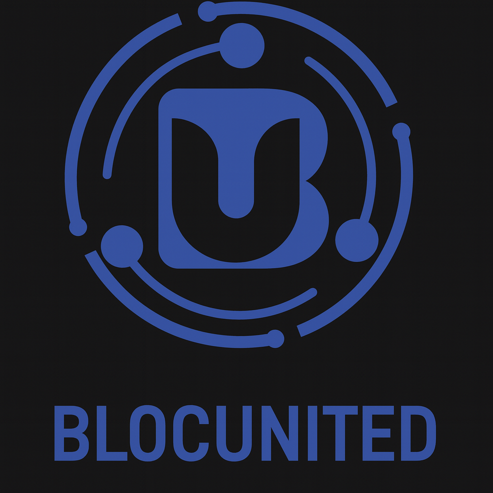

# Content Frame Generator

Automated social media content frame generator designed for N8N workflow integration.

## 🚀 Quick Start for N8N Developers

### Live URL
https://blocunited-llc.github.io/content-frame-generator/

## 📋 URL Parameters (GET Request)

### Basic Usage
https://blocunited-llc.github.io/content-frame-generator/?headline=YOUR_HEADLINE&subhead=YOUR_SUBHEAD

### All Available Parameters

| Parameter | Type | Description | Example |
|-----------|------|-------------|---------|
| `headline` | string | Main headline text (auto-resizes) | `AI%20REVOLUTION` |
| `subhead` | string | Subheading text (auto-resizes) | `BREAKING%20NEWS` |
| `mediaSrc` | URL | Image or video URL | `https://example.com/image.jpg` |
| `mediaType` | string | Type of media: "image" or "video" | `image` |
| `format` | string | Social format: "reels", "square", "story", "post" | `reels` |
| `showMediaLogo` | boolean | Show logo overlay on media | `true` |

### Social Media Formats

- **reels** - TikTok/Instagram Reels (1080x1920) 9:16
- **square** - Instagram Square (1080x1080) 1:1  
- **story** - Instagram Stories (1080x1920) 9:16
- **post** - Instagram Post (1080x1350) 4:5

## 🔧 N8N Workflow Examples

### Example 1: Simple Text Only
```javascript
// Function Node
const baseUrl = 'https://blocunited-llc.github.io/content-frame-generator/';
const params = new URLSearchParams({
  headline: 'YOUR DYNAMIC HEADLINE',
  subhead: 'YOUR SUBHEAD'
});
return { url: `${baseUrl}?${params}` };
```

### Example 2: With DALL-E Generated Image
```javascript
// After DALL-E node generates image
const baseUrl = 'https://blocunited-llc.github.io/content-frame-generator/';
const params = new URLSearchParams({
  headline: items[0].json.headline,
  subhead: items[0].json.subhead,
  mediaSrc: items[0].json.dalle_image_url,
  mediaType: 'image',
  format: 'reels'
});
return { url: `${baseUrl}?${params}` };
```

### Example 3: With Video Content
```javascript
const baseUrl = 'https://blocunited-llc.github.io/content-frame-generator/';
const params = new URLSearchParams({
  headline: 'PRODUCT LAUNCH',
  subhead: 'COMING SOON',
  mediaSrc: 'https://example.com/video.mp4',
  mediaType: 'video',
  format: 'story'
});
return { url: `${baseUrl}?${params}` };
```

## 📸 Screenshot Capture in N8N

### Method 1: Using Puppeteer (Recommended)
```javascript
// Puppeteer Code Node
const puppeteer = require('puppeteer');

async function run() {
  const browser = await puppeteer.launch();
  const page = await browser.newPage();
  
  // Build URL
  const url = `https://blocunited-llc.github.io/content-frame-generator/?headline=${encodeURIComponent($json.headline)}&subhead=${encodeURIComponent($json.subhead)}&mediaSrc=${encodeURIComponent($json.imageUrl)}`;
  
  // Navigate and wait for content
  await page.goto(url, { waitUntil: 'networkidle2' });
  await page.setViewport({ width: 1080, height: 1920 });
  
  // Wait for image to load and text to render
  await page.waitForTimeout(3000);
  
  // Take screenshot
  const screenshot = await page.screenshot({ 
    type: 'png',
    fullPage: false 
  });
  
  await browser.close();
  
  return {
    screenshot: screenshot.toString('base64'),
    url: url
  };
}

return await run();
```

### Method 2: Using HTTP Request with Screenshot API
```javascript
// HTTP Request Node
{
  "method": "GET",
  "url": "https://api.screenshotapi.net/screenshot",
  "qs": {
    "token": "YOUR_API_TOKEN",
    "url": "https://blocunited-llc.github.io/content-frame-generator/?headline=TEST&subhead=NEWS",
    "width": "1080",
    "height": "1920",
    "delay": "3000"
  }
}
```

## 🎯 Complete N8N Workflow Structure

1. Trigger (Schedule/Webhook/Manual)  
2. OpenAI GPT Node - Generate headline/subhead  
3. DALL-E Node - Generate image (optional)  
4. Function Node - Build URL with parameters  
5. HTTP/Puppeteer Node - Take screenshot  
6. Upload Node - Save to storage/social media  

## 💡 Pro Tips

### Dynamic Content from GPT
```javascript
// Prompt for GPT Node
"Generate a viral social media post about [topic]. 
Return JSON format:
{
  'headline': 'max 50 characters, uppercase, punchy',
  'subhead': 'max 30 characters, context',
  'image_prompt': 'description for DALL-E'
}"
```

### URL Encoding
Always encode text parameters:
```javascript
const encoded = encodeURIComponent("Text with spaces & symbols!");
```

### Batch Processing
```javascript
// Process multiple items
const items = $input.all();
const results = [];

for (const item of items) {
  const url = `https://blocunited-llc.github.io/content-frame-generator/?headline=${encodeURIComponent(item.json.headline)}&subhead=${encodeURIComponent(item.json.subhead)}`;
  results.push({ url });
}

return results;
```

## 🐛 Troubleshooting

| Issue | Solution |
|-------|----------|
| Text overflow | Text auto-resizes, but keep headlines <50 chars for best results |
| Image not loading | Ensure image URL is publicly accessible (not behind auth) |
| Logo not showing | Check browser console for errors, ensure logo.png exists |
| Screenshot timing | Add 2-3 second delay for content to fully load |

## 📊 Supported Media Sources

- Images: JPEG, PNG, GIF, WebP  
- Videos: MP4, WebM (autoplay, muted, looped)  
- URLs: Must be HTTPS and publicly accessible  
- DALL-E: Direct URLs from OpenAI work perfectly  
- Unsplash/Pexels: Direct image URLs supported  

## 🔗 Example N8N Template
Import this template into N8N for a ready-to-use workflow:  
[Coming soon - will add exportable N8N workflow JSON]

## 📞 Support
For issues or questions about the template, contact the development team.

Built by BlocUnited LLC for automated social media content generation

---

## 🔧 **HTML Update for Your Logo:**

To make the HTML automatically use your logo.png file, update the template with this modified initialization script:

```javascript
// Add this to the bottom of the script section in index.html
document.addEventListener('DOMContentLoaded', function() {
    // Set default logo on load
    const logoPlaceholder = document.getElementById('logoPlaceholder');
    const mediaLogoContent = document.getElementById('mediaLogoContent');
    
    // Use your logo.png as default
    logoPlaceholder.innerHTML = '';
    mediaLogoContent.innerHTML = '';
    
    // Then load URL parameters
    loadFromURL();
    
    // Fit text after everything loads
    setTimeout(() => {
        fitTextToContainer();
    }, 200);
});
```
